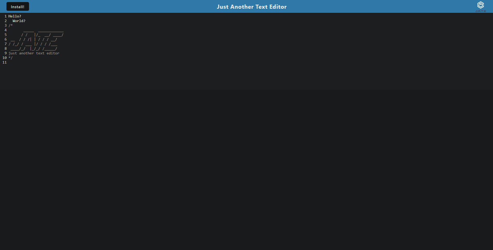

# <Text-Editor>

## Description

A text editor that is available for download and use offline. Allows the user to create notes and ocde snippets regardless of whether they're connected to the internet or not. This allows the notes and snippets to be accessed at any time.

## Installation

Install NPM packages:

    npm install

## Usage

Visit the deployed application here: https://pacific-ocean-01347.herokuapp.com/

## Screenshot

## Technologies Used

    * Express

    * IndexedDB

    * service worker

    * idb

    * Webpacks

    * Babel

    * heroku

## License

This project is under the MIT License - see the LICENSE file for details
